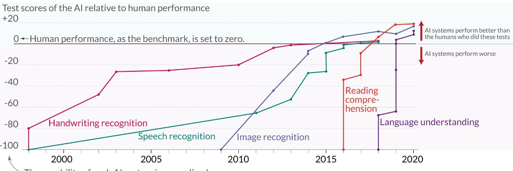
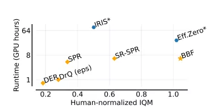
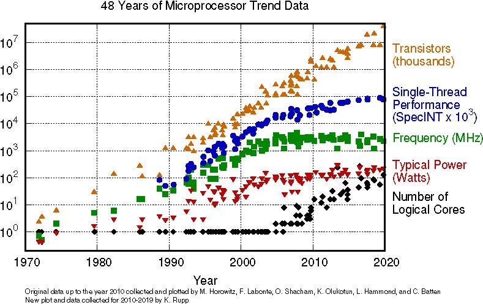
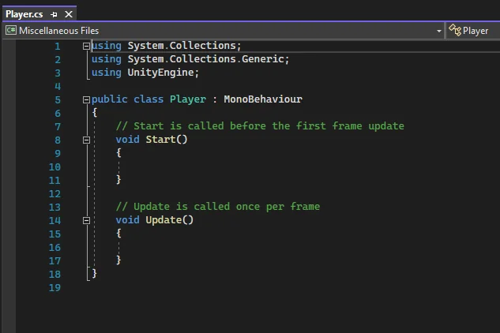

# Graphic engines and machine learning

Machine learning is being unleashed onto the world with tremendous force. Year by year, machines solve more and more problems considered untractable and achieve super-human results.

Reasoning and general game-playing still stand unsolved. We have no doubt algorithm improvements will soon yield super-human performance in those categories too.
Here is a picture taken from https://proceedings.mlr.press/v202/schwarzer23a/schwarzer23a.pdf.
The X axis is the average competence at 26 atari games achieved by various algorithms, where 1 is the human-level ability, while the Y axis is how many hours of A100 GPUs took on average to get there.

Training a network to play an Atarii game takes (or will soon take) less than [32 A100 GPU hours](https://gpus.llm-utils.org/a100-gpu-cloud-availability-and-pricing/). As of 2023, an A100 GPU hour costs between 1 and 5 dollars.

So, as of the moment of writing, a training run for an Atarii game costs in the ballpark of 30-150 dollars. If humanity can achieve a further 100x cost reduction, it will become possible for game designers train a super human playing agent agent that will help them to validate the quality of their designs for a very low price.
Thankfully, it seems that we will not have to wait that long to obtain that [cost reduction](https://www.redsharknews.com/nvidia-wants-to-increase-computing-power-by-a-factor-of-1-million).

Still, 150 dollars seems a low enough cost that we would expect game companies to start adopting machine-learning techniques to at least validate their design before release.

However, this is not happening. We can observe that most of the machine learning datasets about games are either:
* Games solved by directly executing the engine and by inspecting the framebuffer, such as atari games.
* Games with simple rules but large combinatorial complexity, such as chess and go, which can be easily implemented even multiple times for different purposes (interacting with engines, machine learning ...)

Games and simulations with sprawling amounts of rules that both interact with game engines and machine learning tools are almost non-existent.
This lack of games using machine learning has nothing to do with issues on the machine-learning side. The issue is that game rules, as currently implemented in video games, are so deeply mixed with the game engine code that they are not extractable, and thus if one wished to use machine learning techniques, it would need to run the game engine too, making the whole process too complex or too slow.

For the rest of this document, we will explain why this is the case, and how RL will solve it.

## Machine Learning

Machine learning is a resource-consuming process that devours all the computing and all the datasets you can provide them. The more data and compute you feed to a GPU, the better results you will get, and the best way to collect datasets about games is by running them.

Here is a platonic description of how a machine-learning algorithm may interact with the game, either in training or inference mode. The machine learning engines receive the visible state of the game (for example, the framebuffer, the serialized state of the game, or a textual description). The machine learning engine returns the action it has selected to execute, and the game rules (however implemented) advance the simulation to the next state, then the loop begins again.

This setup implies that the execution time is a function of both the execution time of the neural network and the game rules implementation. The faster the game rules run, the more samples of the game you can collect, and the better results machine learning will yield.

The faster rules you will be able to get are those that
* are implemented in a low-level language
* and do not require running any piece of code except for the rules themselves. (That is: rules written independently from graphical engines, network protocols, or similar other mechanisms.)

This requirement is essential since Moore's law for CPU cores is dead, and single CPU core speed is not increasing. Some games may be parallelizable and run on GPUs, but, in general, game rules are intrinsically imperative, and they must use traditional architectures. Since we cannot assume that in the future we will get faster hardware on which to run them,  we must design our solutions to extract every last drop of compute from single CPU cores.

Game rules, as implemented today, are designed with opposite intents than those just expressed, and in the next section, we will see why.

## Games

To deliver 30 or 60 frames per second, games and engines must prioritize the rendering pipeline performances over anything else. While game rules often drive content to the scene, they are conceptually separated from the rendering pipeline algorithms and data structures. Game rules are akin to the business logic of a "buy" button on a website. The business logic tells you what the user wishes to do, but 99% of the complexity lies in forwarding that information to the various actors involved in delivering the product you bought to you and taking care of the payments. Game rules are thus the least critical aspect of game engine designs. It is acceptable for them to be slow or harder to understand as long as the rendering pipeline is the fastest it can be.
 This leads to a development loop where the engine and graphic programmers work on the internals of the engine, while designers hack together game mechanics through high-level features such as Godot scripting language, Unreal engine blueprints, Unity c# classes, and so on.

Here is a Unity c# script, where a designer implements the game rules. Those rules will be expressed in terms of updates driven by the rendering pipeline main loop.  Already, the game logic has been intrinsically tied to the game engine and cannot be extracted.

On top of that, if a piece of code written by a designer ends up being too slow, either because it was poorly written, the programming language itself was too slow, or the problem that programs solve is intrinsically slow, programmers will rewrite by placing performances at the forefront. Often this process will extract parts of the logic and will move then deeper down into the engine until parts of the game logic are no longer executable without executing the whole engine.

Rules are therefore:
* slow
* hard to run without the engine, making them even slower
* hard to refactor

All of these issues impede machine learning adoption in the game programming space. In the next section, we will see what solution we propose.

## Unifying games and machine learning.

From the previous sections we have seen that the requirements imposed by machine learning and game programming are very different, let us recap them here. Game rules must be
* **inspectable data structures**: the state of the game is of interest to the machine learning engine, so it must be inspectable, serializable, and copiable.
* **have enumerable actions**: the machine learning component will interact with the simulation by deciding which actions must be executed, so they must be all known.
* **implemented in a low-level language**: so that single-core CPU performances are not left on the table.
* **interoperable with C**: so that the language can interact with machine learning tools and game programming tools, as well as allowing programmers to write optimized C code if they wish.
* **engine independent**: so that samples can be generated without running the engine
* **easily writable**: so that game designers can still write and refactor it. We should assume that in the future automatic code editing through LLM and similar techniques will be very common. It is important to create a language that is as easy as possible to edit for machines as well.

To meet those requirements we have designed RL with the following characteristics:
* **LLVM-based compiled language**: LLVM is a compiler framework used by many compilers (such as rustic, clang, and so on). Reinventing the wheel would lead to worse performances.
* **Statically typed language**: All possible analyses on the code, such as discovering all the possible actions as functions that can advance the game state, should be performed during compilation. Thus, we should design the language so the compiler can get as much insight as possible into the program.
* **Same ABI as C**: By laying our structs in memory the same way C does and by following the same calling conventions we obtain trivial compatibility with C programs and, transitively, with every application compatible with C (for example, with Python due to ctypes).
* **Imperative language**: Game rules are conceptualized by designers as procedures players must follow. Since we are trying to produce a simple language, we should strive to keep the difference between how one thinks of games and how one implements them. Thus, RL must be an imperative language.

Finally, the most important feature is
**Engine independence**: which we explain how to achieve [here](./language_tour.md).
